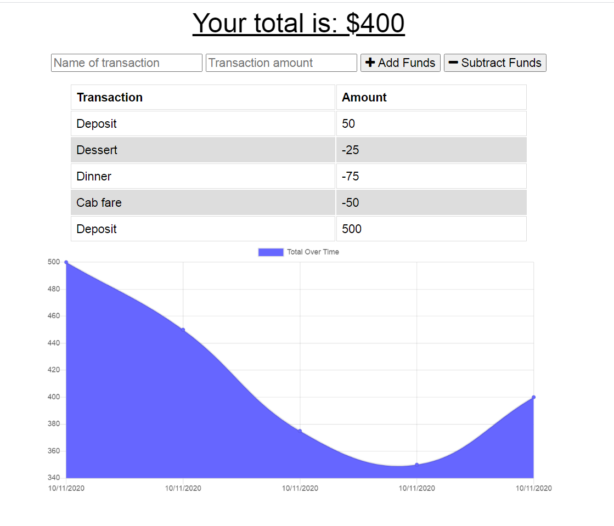
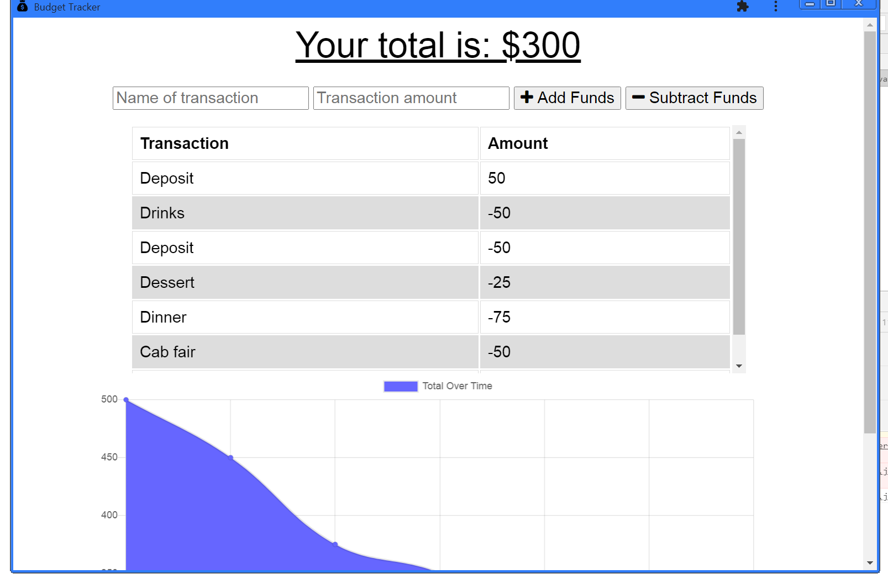
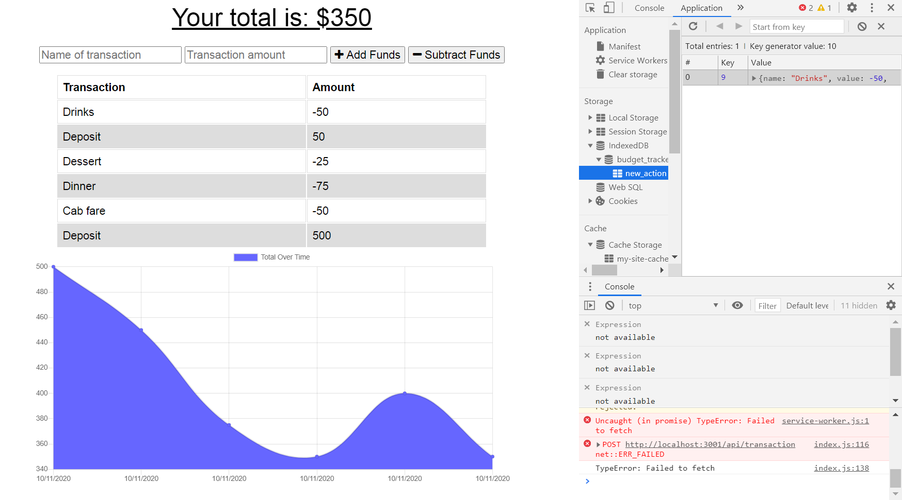

# Budget Tracker

## Description
The Budget Tracker application allows a user to input deposits and withdrawals in order to keep track of funds. The application is also available as a PWA and functions online or offline.
  
## Table of Contents
* [Installation](#installation)
* [Usage](#usage)
* [License](#license)
* [Questions](#questions)
 
## Installation
Clone the repo and run "npm install".

## Usage
A user simply describes the type of transation, enters the amount of the transaction, then chooses the correct button for a deposit (add funds) or withdrawal (subtract funds). The amount will be added or subtracted from the total, and the change will automatically be indicated on the associated chart.

The application is a Progressive Web Application (PWA) and can be downloaded to a desktop or home screen for ease-of-use. 

Transaction will be recorded, regardless of internet access, and when offline, totals will be updated as soon as a connection is resumed.

## License
This project is licensed under a Creative Commons license. 

## Questions
Have additional questions? Contact [cjacktwil](http://github.com.cjacktwil) or email traceyjackson112@gmail.com.
